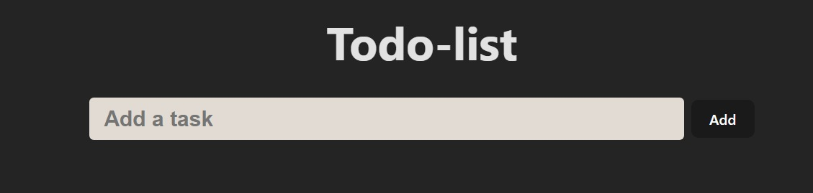
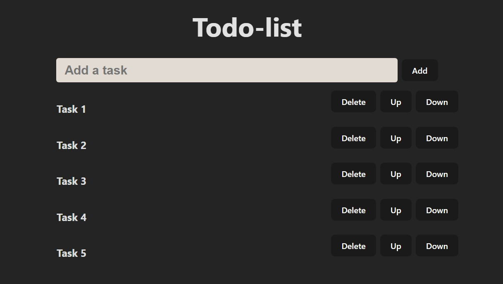

# Todo-React app

---

- This is a React-Vite-based application.

- In order to recall what needs to be done in the workplace, this is utilized to reduce the workload.

- This to-do app features an input box with an add button next to it that allows you to add tasks to your to-do list. Alternatively, you may press enter to add tasks directly to the list.

- Once a job is added to the list, you can edit it by deleting it, moving it up or down, or rearranging it to better suit your needs.

  

- [Delete] --> Press to delete the task
- [Up] --> Press to move upwards the task
- [Down] --> Press move downwards the task
